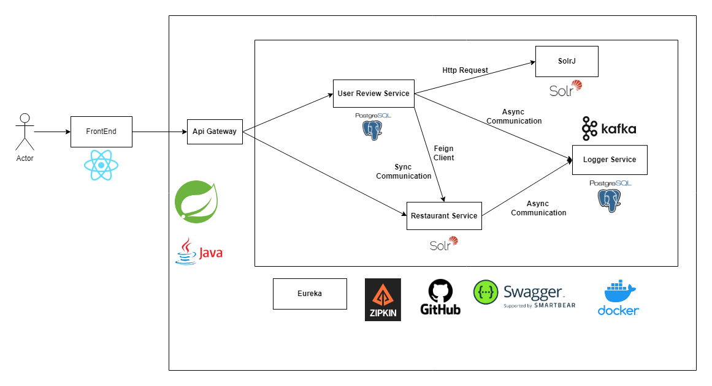

# N11 Bootcamp Graduation Project - Backend

Bu proje, N11 Bootcamp mezuniyet projesinin backend kısmını içerir. Projemizin frontend kısmı için [buraya](https://github.com/ismailkarakayax/n11-talenthub-graduation-project-frontend) bakabilirsiniz.

## Kurulum Adımları

1. Proje dizinine gidin:

    ```bash
    cd path/to/n11-talenthub-graduation-project
    ```

2. Docker'ı başlatın:

    ```bash
    docker-compose up
    ```

3. Projenin Docker üzerinden başlatılmasının ardından aşağıdaki bağlantılar başlığının altındaki linklerden projeyi kullanabilirsiniz.

## Gereksinimler

Projenin çalışması için aşağıdaki gereksinimlere ihtiyacınız olacaktır:

- Docker
- Maven

## Microservice Yapısı



## Proje Tanıtım Videosu

Proje tanıtım videosu için [buraya](https://drive.google.com/file/d/1rvkskjfT38yXtGcqkkOOfzsCHh5InSFS/view?usp=sharing) tıklayabilirsiniz.

## Bağlantılar

| Servis | Bağlantı |
|--------|----------|
| Frontend | [TalentHub Frontend](https://github.com/ismailkarakayax/n11-talenthub-graduation-project) |
| Swagger UI (User Review Service) | [User Review Service Swagger](http://localhost:8081/swagger-ui/index.html#) |
| Swagger UI (Restaurant Service) | [Restaurant Service Swagger](http://localhost:8082/swagger-ui/index.html#) |
| Eureka | [Eureka Dashboard](http://localhost:8761) |
| Zipkin | [Zipkin Dashboard](http://localhost:9411/zipkin) |
| Solr | [Solr Dashboard](http://localhost:8983/solr/#/) |

## Kullanılan Teknolojiler

### User Review Service

| Teknoloji | Versiyon |
|-----------|----------|
| Java | 21 |
| Spring Boot | 3.2 |
| Spring Data JPA | |
| Spring Web | |
| Feign Client | |
| SolrJ | |
| Kafka | |
| Eureka Client | |
| PostgreSQL | |
| Swagger | |
| Spring Boot Validation | |
| Lombok | |
| Mapstruct | |
| Spring Cloud | |
| Actuator | |
| Zipkin | |

### Restaurant Service

| Teknoloji | Versiyon |
|-----------|----------|
| Java | 17 |
| Spring Boot | 2.7.3 |
| Spring Data Solr | |
| Spring Web | |
| Kafka | |
| Eureka Client | |
| Swagger | |
| Spring Boot Validation | |
| Lombok | |
| Mapstruct | |
| Spring Cloud | |
| Zipkin | |

### Api Gateway

| Teknoloji | Versiyon |
|-----------|----------|
| Java | 21 |
| Spring Boot | 3.2 |
| Spring Cloud | 2023.0.0 |
| Spring Gateway MVC | |
| Eureka Client | |
| Spring Cloud | |
| Actuator | |
| Zipkin | |

### Discovery Server

| Teknoloji | Versiyon |
|-----------|----------|
| Java | 21 |
| Spring Boot | 3.2 |
| Spring Cloud | 2023.0.0 |
| Eureka Server | |
| Spring Cloud | |
| Actuator | |
| Zipkin | |

### Logger Service

| Teknoloji | Versiyon |
|-----------|----------|
| Java | 21 |
| Spring Boot | 3.2 |
| Spring Data JPA | |
| Spring Web | |
| Kafka | |
| Eureka Client | |
| PostgreSQL | |
| Lombok | |
| Spring Cloud | |
| Actuator | |
| Zipkin | |

## Lisans

Bu proje MIT lisansı altında lisanslanmıştır. Daha fazla bilgi için [LICENSE](LICENSE) dosyasına göz atabilirsiniz.